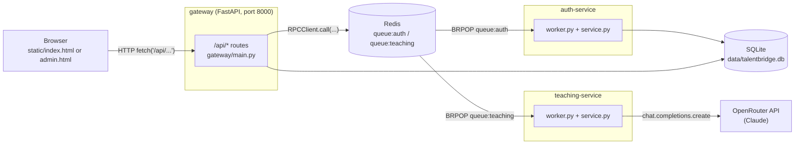

# Architecture

## Processes

Talent Bridge runs as four processes (one per Docker Compose service):

- **gateway** — the only process that speaks HTTP. Owns every `/api/*` route
  ([gateway/main.py](../gateway/main.py)) and serves the two static frontends directly
  off disk via `StaticFiles`. It reads/writes SQLite directly for anything that isn't
  auth or AI-teaching logic (courses, sections, messages, progress, credentials, jobs).
- **auth-service** — a headless worker process with no HTTP surface. It owns the
  `users`, `employers`, `admins`, and `auth_tokens` tables and does password
  hashing/verification and token issuance/lookup.
- **teaching-service** — a headless worker process that calls Claude (via OpenRouter)
  to generate Socratic replies and to evaluate a finished conversation. It never touches
  SQLite — the gateway passes it the section content and conversation history in the
  RPC payload and persists whatever comes back.
- **redis** — not a database here, purely a message transport for the RPC calls
  described below.

Why split it this way (see the [README](../README.md#tech-stack) for the summary):
auth and teaching are isolated into their own processes so that a slow/hanging Claude
call in teaching-service can't block login or course browsing, and so credentials are
handled in one place. They're deliberately *not* separate HTTP services behind their
own ports — Redis request/reply queues were simpler than standing up internal HTTP
clients/servers for two low-traffic internal calls.

## The RPC layer

Gateway → service calls do not go over HTTP. They go through
[common/rpc.py](../common/rpc.py), a small Redis-backed request/reply protocol shared
by both sides:

1. `RPCClient.call(action, payload)` (used by the gateway) generates a random
   `reply:<uuid>` key, `LPUSH`es `{"action", "payload", "reply_to"}` onto
   `queue:<service>`, then `BLPOP`s the reply key until a response shows up or its
   timeout elapses (10s default; the teaching client is constructed with a 60s timeout
   since Claude calls are slower — see `teaching_client = RPCClient("teaching",
   timeout=60)` in [gateway/main.py](../gateway/main.py)).
2. `RPCWorker` (used by each service's `worker.py`) blocks on `BRPOP queue:<service>`,
   looks up a handler registered by name via `@worker.register("action_name")`, calls
   it with the payload unpacked as kwargs, and `RPUSH`es `{"ok": true, "result": ...}`
   or `{"ok": false, "error": ...}` onto the `reply_to` key (with a 30s TTL so orphaned
   reply keys don't accumulate).

Two exception types surface this back up to a gateway route:
- `ServiceError` — the service ran but rejected the request (e.g. "email already
  exists", raised as a `ValueError` in the handler). Gateway routes catch this and
  return `{"error": <message>}`.
- `ServiceUnavailableError` — no reply arrived before the timeout (service down, or
  Claude is unusually slow). Gateway routes catch this and return a generic
  "service is unavailable" error.

Both worker loops retry on `redis.exceptions.TimeoutError` rather than treating it as
fatal — that's redis-py's own socket-level read timeout occasionally racing the
BLPOP/BRPOP call's `timeout` argument, not an actual failure (see the comments in
[common/rpc.py](../common/rpc.py)).

There is no service discovery, retries-with-backoff, or dead-letter handling beyond
this — it's intentionally minimal for two low-QPS internal services.

## Request lifecycle: sending a chat message

Walking `POST /api/chat` end to end shows how the pieces fit together
(handler: `chat()` in [gateway/main.py](../gateway/main.py)):

1. Browser sends `{section_id, message}` with `Authorization: Bearer <token>`.
2. Gateway calls `auth_client.call("get_account_from_token", {"token": ...})` over RPC
   to resolve the token to an account; rejects if not a learner (`account_type ==
   "user"`).
3. Gateway reads the section's `content` and the existing conversation directly from
   SQLite (`sections`, `messages` tables).
4. Gateway saves the learner's new message to `messages`, then calls
   `teaching_client.call("generate_teaching_reply", {section_content, conversation})`.
5. teaching-service builds a system prompt scoped to *only* that section's content
   (see [teaching-and-evaluation.md](teaching-and-evaluation.md)) and calls Claude via
   OpenRouter.
6. Gateway saves the assistant's reply to `messages` and returns `{reply}` to the
   browser.

`POST /api/sections/complete` follows the same shape but calls
`evaluate_section` instead, persists the three scores + evidence onto
`section_progress`, and checks whether every section in the course is now complete —
if so it inserts a row into `credentials`. See
[data-model.md](data-model.md#derived-state) for exactly how completion and credential
issuance are computed.

## Data storage

A single SQLite file (`data/talentbridge.db` on the host, bind-mounted to `/data/talentbridge.db`
inside every container) is shared by the gateway and auth-service. Both connect with
`check_same_thread=False` and open their own `sqlite3.connect(...)` handle — there's no
connection pooling or ORM. `schema.sql` is applied automatically on gateway container
startup ([gateway/entrypoint.sh](../gateway/entrypoint.sh)) and is idempotent
(`CREATE TABLE IF NOT EXISTS` throughout), so it's safe to restart repeatedly. See
[data-model.md](data-model.md) for the full schema.

## Frontend

There's no build step. `static/index.html` and `static/admin.html` are each a single
file containing all HTML/CSS/JS, mounted directly at `/` and `/admin.html` by
`StaticFiles` in [gateway/main.py](../gateway/main.py). See
[frontend.md](frontend.md) for how they're structured internally.
