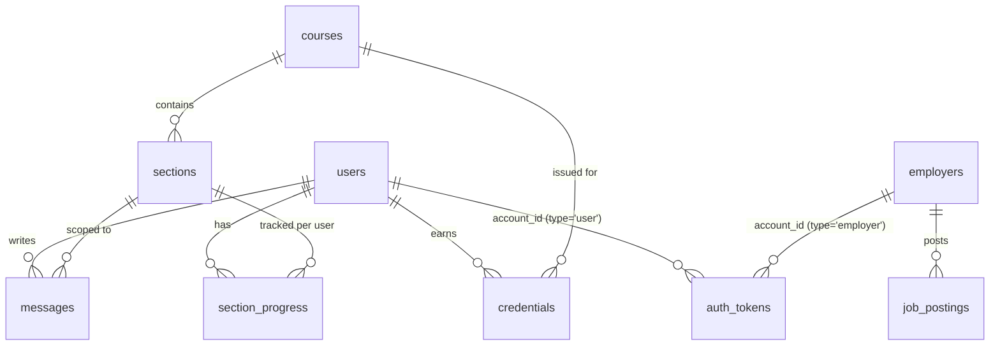

# Data Model

Single SQLite file, defined in [schema.sql](../schema.sql), applied idempotently on
every gateway startup. No migrations framework — schema changes are made by adding
more `CREATE TABLE IF NOT EXISTS`/`ALTER TABLE` statements to that one file.

(`admins` also has rows in `auth_tokens` via `account_type = 'admin'`, omitted above
for clarity — see [auth-and-accounts.md](auth-and-accounts.md).)

## Tables

### `users`, `employers`, `admins`
Three completely separate account tables — there is no shared `accounts` table. Each
has its own `id` space, its own `password_hash`, and its own login RPC action
(`login_user` / `login_employer` / `login_admin`). `users` additionally carries the
free-text profile fields shown on signup and in the admin console: `education`,
`experience`, `current_company`, `certifications`. There is no public signup for
`admins` — see [auth-and-accounts.md](auth-and-accounts.md).

### `auth_tokens`
One row per active session: `token` (the opaque bearer token, primary key),
`account_type` (`'user' | 'employer' | 'admin'`), `account_id`. Looking up a token is
a single `SELECT` in `get_account_from_token` (auth-service); there is no expiry
column, so tokens are valid until `logout()` deletes them from `localStorage`
client-side (there's no server-side revoke endpoint).

### `courses` / `sections`
A course is a `slug` + `title` + `description` + `display_order`. Its sections each
have a `section_number` (a display string like `"1.1"`, not an integer — sorting for
display uses `display_order`, not this field), `title`, and `content` (the teaching
material, several paragraphs of text, generated by [generate_courses.py](../generate_courses.py)
and shown verbatim to both the learner and the teaching-service prompt).

### `messages`
Every chat turn, keyed by `(user_id, section_id)`, with `role` (`'user' | 'assistant'`)
and `content`. This is both the persisted chat history *and* the transcript handed to
the evaluation prompt — there's no separate "final transcript" snapshot; evaluation
re-reads whatever's in `messages` at the moment `/api/sections/complete` is called.

### `section_progress`
The one row per `(user_id, section_id)` (composite primary key) that tracks a
learner's status on a section: `status` (`'in_progress' | 'completed'`), the three
score columns (`speed_score`, `explanation_score`, `question_sharpness_score`), free-text
`evidence`, and `started_at`/`completed_at`. A row is created with `status =
'in_progress'` the first time a learner opens a section (`GET
/api/sections/{id}` in [gateway/main.py](../gateway/main.py)), and updated to
`'completed'` either by a real evaluation (`POST /api/sections/complete`) or by an
admin override (`POST /api/admin/users/{id}/sections/{id}/override` or `.../bulk_override`).

### `credentials`
One row per `(user_id, course_id)` issued the moment every section in that course has
`status = 'completed'` in `section_progress` — see
[Derived state](#derived-state) below. There's no `UNIQUE` constraint on
`(user_id, course_id)` at the DB level; the uniqueness is enforced in application code
(`issue_credential_if_complete` checks for an existing row before inserting).

### `job_postings`
An employer's job listing: `title`, `description`, and `required_course_ids` stored as
a **JSON-encoded array of integers in a TEXT column** (e.g. `"[1, 2]"`) rather than a
join table. Matching candidates are computed at read time (see
[api-reference.md](api-reference.md#get-apiemployerjobs)), not stored.

## Derived state

Two pieces of state are *computed*, not stored directly, and it's worth knowing where:

- **Section status shown to a learner** (`not_started | in_progress | completed`) —
  computed per-request in `GET /api/courses/{id}/sections` by checking whether a
  `section_progress` row exists for that user/section and what its `status` is.
  There's no status column that's independently "the truth"; `section_progress`
  existing at all means `in_progress` or `completed`.
- **Credential issuance** — `issue_credential_if_complete(user_id, course_id)` in
  [gateway/main.py](../gateway/main.py) counts `sections WHERE course_id = ?` vs.
  `section_progress WHERE status = 'completed'` joined to that course; a credential is
  inserted only when those counts match *and* no credential row already exists. This
  runs after every real completion and every admin override (single or bulk), so a
  course's credential can be earned by overriding its last remaining section without
  touching the others.
- **Job/candidate matching** — `GET /api/employer/jobs` computes matches live: a
  candidate matches a job if they hold a `credentials` row for *every* course ID in
  that job's `required_course_ids`. This is a `COUNT(DISTINCT course_id) = len(required)`
  query per job, not a stored relationship, so newly earned credentials show up on
  existing job postings automatically.

## Admin overrides and reverts

Admins can bypass real Socratic evaluation entirely:
- `POST /api/admin/users/{user_id}/sections/{section_id}/override` and its bulk sibling
  `.../sections/bulk_override` both call `apply_section_override(...)`, which
  `UPSERT`s `section_progress` straight to `status = 'completed'` with admin-supplied
  scores (default evidence string: `"Manually overridden by admin."`), then runs
  `issue_credential_if_complete`.
- `POST /api/admin/users/{user_id}/sections/bulk_revert` does the reverse: it
  `DELETE`s the `section_progress` row(s) entirely (back to `not_started`, not just
  flipped to `in_progress`) and `DELETE`s any `credentials` row for a course that had
  one of its sections reverted — so reverting a single section retroactively revokes
  a credential that depended on it.

This is the mechanism behind the admin console's "Mark complete (override)" /
"Revert to not started" UI — see [frontend.md](frontend.md#adminhtml) for the client
side.
