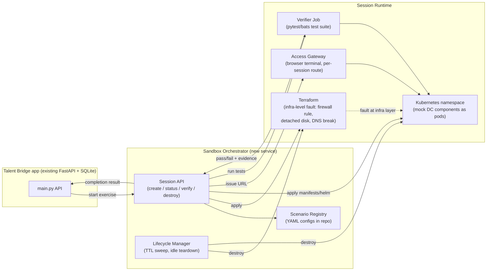
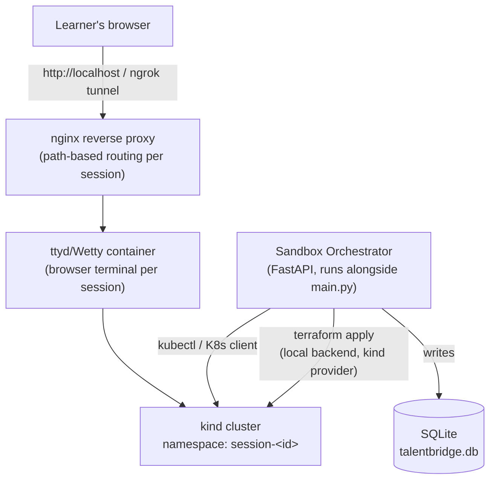
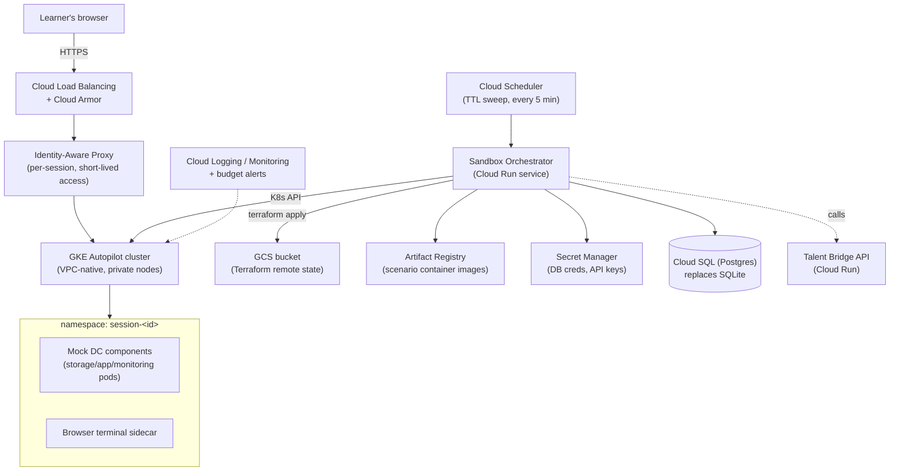
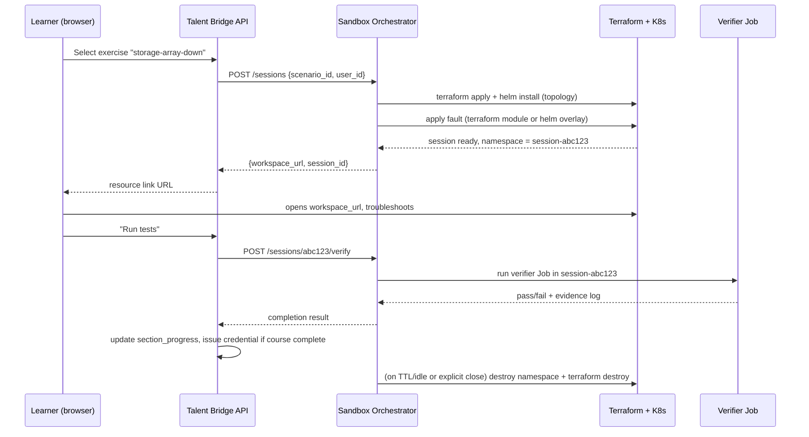

# Sandbox Solution — Cloud Architecture

> **Status: not implemented.** The scaffolded implementation this document originally described (`services/sandbox_service`, the `charts/scenario-base` Helm chart, the `terraform/` modules) has been removed from the codebase. This document is kept as a design reference only, and as a record of why the feature was cut.
>
> The plan below assumes mock components — a `mock-iscsi-target` container standing in for a real storage array, a `mock-app-server` for a real app tier — can be built cheaply and still teach real troubleshooting instincts. That assumption didn't survive contact with the actual problem (see §9's "Mock fidelity" open question, which flagged this risk from the start). Storage/network vendor software isn't something you can stub convincingly:
>
> - Most enterprise platforms have no public simulator at all (e.g. Dell PowerMax — no downloadable array simulator; realistic access requires a Dell Demo Center account or a real array's SYMAPI database).
> - Where a real simulator exists (e.g. NetApp's ONTAP Simulator / "vsim"), it still requires a vendor support account and per-provider setup — i.e. collaboration with each software provider to provision training licenses, not something buildable unilaterally.
> - Recorded-replay fixtures or LLM-generated CLI output can look plausible but get column widths, edge cases, and failure modes subtly wrong — output that a real storage/network operator would immediately clock as fake, which undermines the exact "prove real understanding" premise this platform is built on.
>
> Full reasoning and the researched per-vendor options: [no-sim-justification.md](no-sim-justification.md). A future revival of this feature should start with vendor partnerships/training-account access, not another mock-container spike.

Companion to Solution 3 in the [Product Requirement Document](Product%20Requirement%20Document_draft.md). This document proposes an architecture for the incident-simulation sandbox — covering a local implementation (fast to build, good for the hackathon demo) and a GCP implementation (what it looks like once this needs to run for real, multi-tenant users).

## 1. Recap: what the sandbox has to do

From the PRD:

- A learner picks an incident exercise (e.g. "storage array unreachable," "application facing latency").
- They get a resource link URL to a cloud workspace that mocks the relevant data-center components.
- The exercise is defined by a config file. Workspaces are issued via Kubernetes; the config also drives Terraform, specifically to trigger the incident.
- The learner troubleshoots inside the sandbox to restore functionality, then runs a test suite that proves the exercise is complete.

That maps to five concrete jobs: **provision** a workspace, **inject** a specific failure into it, **expose** it to one learner over a URL, **verify** the fix, and **tear it down**. Everything below is organized around those five jobs so the local and GCP variants stay easy to compare.

## 2. Terminology

| Term | Meaning |
|---|---|
| **Scenario** | A named exercise definition (e.g. `storage-array-down`) — the mock topology, the specific fault, and the pass/fail test suite. |
| **Session** | One learner's live instance of a scenario — a running, isolated copy they can break and fix without affecting anyone else. |
| **Workspace** | The thing the learner actually gets a URL to — a browser terminal (and optionally a small dashboard) into their session. |
| **Fault injection** | The mechanism that puts the session into the broken state matching the scenario. |
| **Verifier** | The test suite that checks the session is back to healthy and reports pass/fail with evidence. |

## 3. Component architecture (common to both variants)



The orchestrator is a new service, not a new product — it plugs into the existing completion flow the same way `teaching_service.evaluate_section` does today: [main.py:203](main.py#L203) calls into a service, gets a score/evidence back, and updates `section_progress`. The sandbox verifier result should flow into that exact same table and credential-issuance path, so a sandbox exercise and a conversational section look identical to the rest of the app.

### 3.1 Scenario definition format

One config drives all three provisioning layers (Terraform, Kubernetes, and the test suite), so there's a single source of truth per exercise:

```yaml
# scenarios/storage-array-down.yaml
id: storage-array-down
title: "Storage array unreachable"
description: >
  A production app server has lost connectivity to its iSCSI storage array.
  Learner must diagnose and restore the path.

topology:
  helm_chart: charts/scenario-base
  components:
    - name: storage-array
      image: mock-iscsi-target:latest
    - name: app-server
      image: mock-app-server:latest
      depends_on: [storage-array]
    - name: monitoring
      image: mock-monitoring:latest

fault:
  layer: infra          # infra -> terraform, app -> k8s/helm override
  terraform_module: modules/fault-network-block
  variables:
    target: storage-array
    block_port: 3260     # iSCSI

verifier:
  image: verifier-storage-array-down:latest
  command: ["pytest", "test_storage_path.py"]
  timeout_seconds: 120

session:
  ttl_minutes: 90
  idle_timeout_minutes: 20
```

- `topology` is a Helm chart + values — the mock components (storage array, app server, monitoring stack) as lightweight containers standing in for real DC hardware.
- `fault` says *how* to break it. Infra-layer faults (a blocked port, a detached volume, a DNS record removed) go through Terraform, matching the PRD's explicit call-out that Terraform is used "specifically to trigger an incident." App-layer faults (a misconfigured service, a bad config file) are just a different Helm values overlay — no need to reach for Terraform when a K8s object change does it.
- `verifier` is a container that runs a test suite against the session and exits 0/non-zero, with structured output the orchestrator can store as evidence — mirroring the evidence-based scoring in `teaching_service.py`.

## 4. Option A — Local implementation

Best fit for the hackathon build and for day-to-day development: no cloud account dependency, fast iteration, zero cost.



- **Cluster**: [`kind`](https://kind.sigs.k8s.io/) (Kubernetes-in-Docker) or Minikube on the same machine/VM that already runs `main.py`. One cluster, one namespace per active session.
- **Terraform**: local state file, `kind`/`kubernetes` provider — same HCL modules used later against GCP, just pointed at a different provider/backend. This is the detail that keeps the local and GCP paths from diverging into two codebases.
- **Access**: a `ttyd` or `wetty` container gives a browser-based terminal into the learner's namespace; nginx (or Caddy) does path-based routing (`/sandbox/<session-id>/`) so one exposed port serves every active session. For a live demo, an `ngrok`/`cloudflared` tunnel turns `localhost` into a shareable URL without any cloud setup.
- **Orchestrator**: a small FastAPI module run alongside (or inside) the existing `main.py` process — same pattern as `auth_service`/`teaching_service`. No separate infra needed for the MVP.
- **State**: session metadata reuses the existing SQLite file — a `sandbox_sessions` table (scenario_id, user_id, namespace, status, started_at, expires_at) alongside the current tables.
- **Fits**: 1 concurrent learner (a demo/interview), or a handful during internal testing. Not meant to survive a laptop reboot — sessions are inherently ephemeral here.

## 5. Option B — GCP implementation

What this becomes once real learners are creating sessions concurrently and the sandbox needs to run unattended.



- **Cluster**: **GKE Autopilot** — Google manages node provisioning/scaling per pod, which matters here because sandbox load is bursty (zero sessions most of the time, N sessions during a workshop) and Autopilot bills per-pod rather than for idle nodes. VPC-native, private nodes, no public IPs on session pods.
- **Terraform**: same modules as local, swapped to the `google` provider, with state in a GCS bucket instead of local disk. This is the one line of the architecture worth being disciplined about — keep provider-specific values in `terraform.tfvars` per environment, not in the modules themselves, so `local` and `gcp` genuinely share code.
- **Isolation & multi-tenancy** (the part that matters most once this is public-facing):
  - One **namespace per session**, created and destroyed by the orchestrator.
  - `NetworkPolicy` denying east-west traffic between namespaces — a learner's sandbox should never be able to see another learner's sandbox.
  - `ResourceQuota` + `LimitRange` per namespace so one runaway session can't consume the cluster (and can't blow up the GCP bill).
  - Pod Security Standards set to `restricted` — mock components don't need root or host access.
- **Access**: Identity-Aware Proxy or short-lived, session-scoped signed URLs in front of the browser-terminal sidecar, instead of exposing sessions on the open internet. This replaces the local nginx path-routing with something that actually authenticates the learner as the owner of that specific session.
- **Orchestrator**: Cloud Run (scales to zero, same billing shape as Autopilot — you don't pay when no one's doing an exercise). Talks to the GKE API and to Terraform the same way the local version does, just against different credentials.
- **Images**: scenario container images (mock storage array, mock app server, verifier images) live in Artifact Registry, built via Cloud Build on push — this is also where "author a new scenario" becomes a PR that adds a YAML file plus however many mock-component images it needs.
- **Data**: SQLite doesn't hold up under concurrent multi-instance access, so the main app's database moves to Cloud SQL (Postgres) at the same time the sandbox goes to GCP — both the app and the sandbox orchestrator read/write `sandbox_sessions`, `section_progress`, `credentials` there.
- **Lifecycle**: Cloud Scheduler hits the orchestrator every few minutes to sweep expired/idle sessions (`ttl_minutes`/`idle_timeout_minutes` from the scenario config) and run `terraform destroy` + namespace deletion — this is the control that keeps cost bounded.
- **Secrets**: Secret Manager for DB credentials, the OpenRouter key, and any service-to-service auth — mirrors how `OPENROUTER_KEY` is loaded via `.env`/`dotenv` today in [teaching_service/service.py](../services/teaching_service/service.py), just moved out of a `.env` file.

## 6. End-to-end session flow (both variants)



This intentionally mirrors the existing `/api/chat` → `/api/sections/complete` flow in [main.py](main.py#L168-L235): a sandbox exercise is just a different way to produce a score and evidence for a section, not a parallel system.

## 7. Local vs GCP — comparison

| | Local (kind/Minikube) | GCP (GKE Autopilot) |
|---|---|---|
| Setup time | Minutes | Hours (Terraform bootstrap, IAM, networking) |
| Cost | Free | Pay-per-pod (Autopilot) + Cloud Run + Cloud SQL, scales to ~$0 when idle |
| Concurrent learners | ~1, single machine | Many, autoscaled |
| Isolation guarantees | Namespace-level only, single-tenant machine | Namespace + NetworkPolicy + IAP, safe for public multi-tenant use |
| Access mechanism | nginx path routing / tunnel | IAP / signed session URLs behind Cloud LB |
| Database | SQLite (shared with main app) | Cloud SQL (Postgres) |
| Good for | Hackathon demo, scenario authoring/testing | Real learners, production credential issuance |

## 8. Suggested build order

1. **Phase 0 — demo-only**: one hardcoded scenario, `docker-compose` (no K8s yet), a single ttyd terminal, manual fault via a shell script. Enough to show the pitch's incident-simulation claim live.
2. **Phase 1 — local, general**: introduce `kind` + the scenario YAML format + Terraform-driven fault injection + the verifier Job pattern, 2-3 scenarios. This is the point where the architecture is "real" but still runs entirely on one machine.
3. **Phase 2 — GCP**: swap Terraform provider and backend, move DB to Cloud SQL, add IAP/namespace isolation, wire up Cloud Scheduler for TTL sweeps. No changes needed to scenario YAML or the orchestrator's API surface — that's the payoff of keeping Phase 1's interfaces cloud-agnostic.

## 9. Open questions

- **Mock fidelity**: how realistic do the mock storage/network components need to be for the exercise to teach real troubleshooting instincts? (Affects whether `mock-iscsi-target` etc. are simple stub containers or thin wrappers around real open-source implementations like `tgt` or FRRouting.)
- **Concurrent scenario authoring**: who writes new scenario YAMLs and mock images, and is there a review step before a scenario goes live (parallel to the PRD's human review of AI-drafted course content)?
- **Cost ceiling on GCP**: what's the per-learner sandbox budget, and does the idle/TTL timeout need to be tighter than 90/20 minutes to stay within it?
